# Java快速

## 一、maven项目

### Maven基础配置

1. [maven仓库搜索需要的jar]([Maven Repository: mysql](https://mvnrepository.com/search?q=mysql))

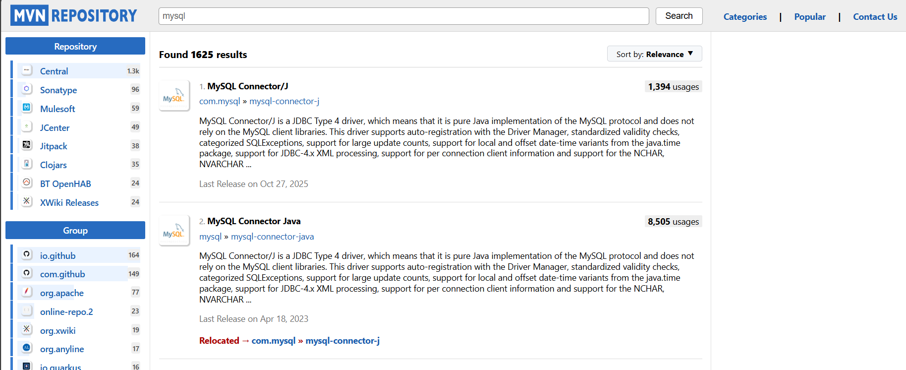

2. 选一个用的多的版本


3. 往下滑就可以看到Maven 的坐标

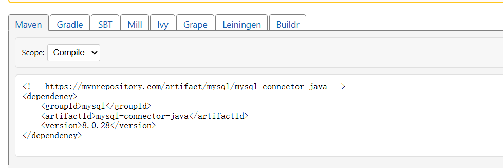

5. [下载Maven]([Download Apache Maven – Maven](https://maven.apache.org/download.cgi))

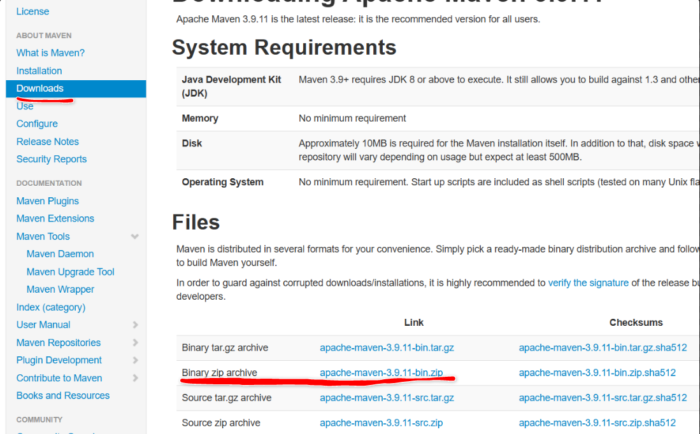

6. 解压下载好的Maven,打开settings.xml配置本地仓库

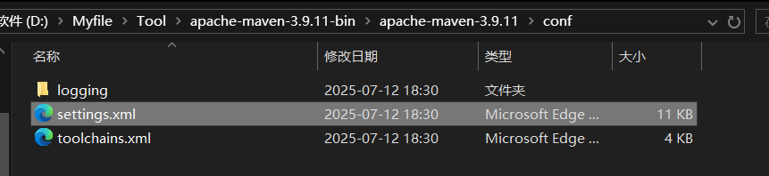

7. 随便选择一个目录作为本地仓库，可以使用我提供的本地仓库
8. 在 settings.xml 配置文件中指定本地仓库位置

```
<localRepository>D:/repository</localRepository>
```

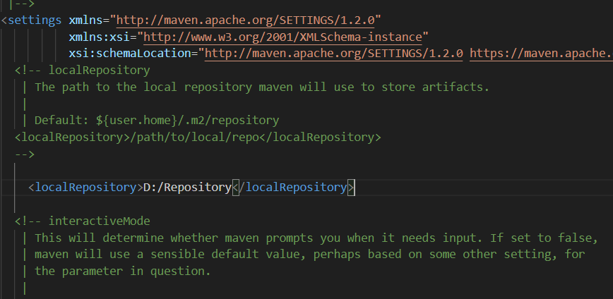

9. 配置镜像仓库

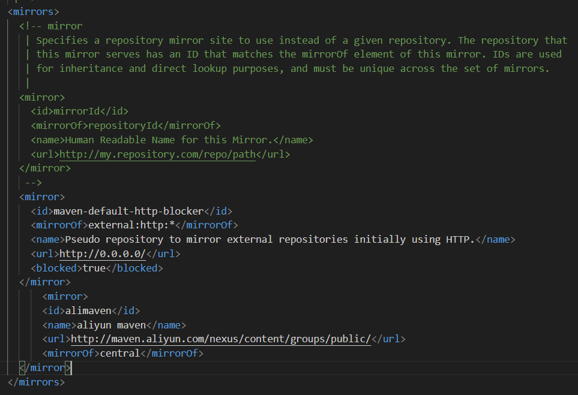

10. 配置JDK(注意jdk版本) 此处用JDK17

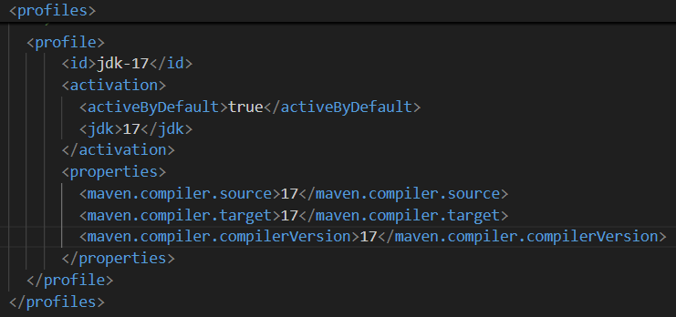

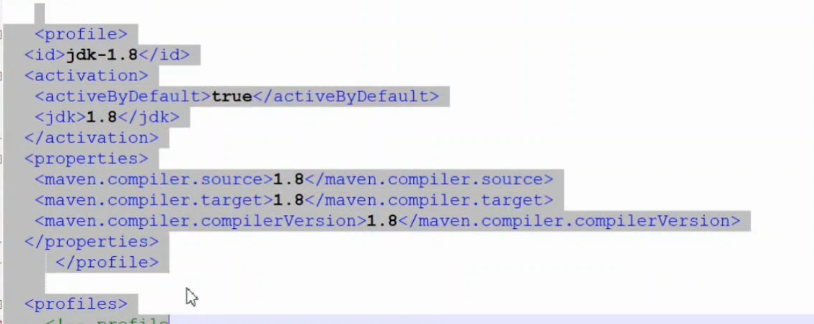

注意：高版本如果不匹配，则降低版本

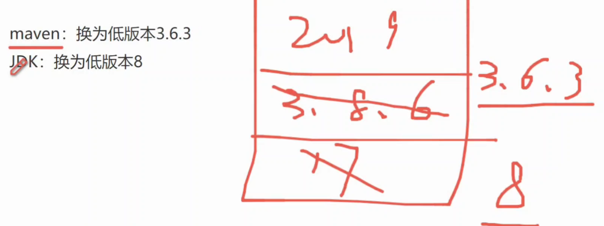

### 创建Maven项目

1. IDEA新建一个空项目，在空项目再创建模块TestMaven
2. 进行配置

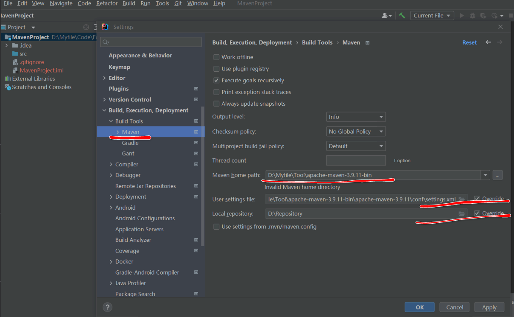

3. 新建一个模块，选择Maven,填写项目的坐标

   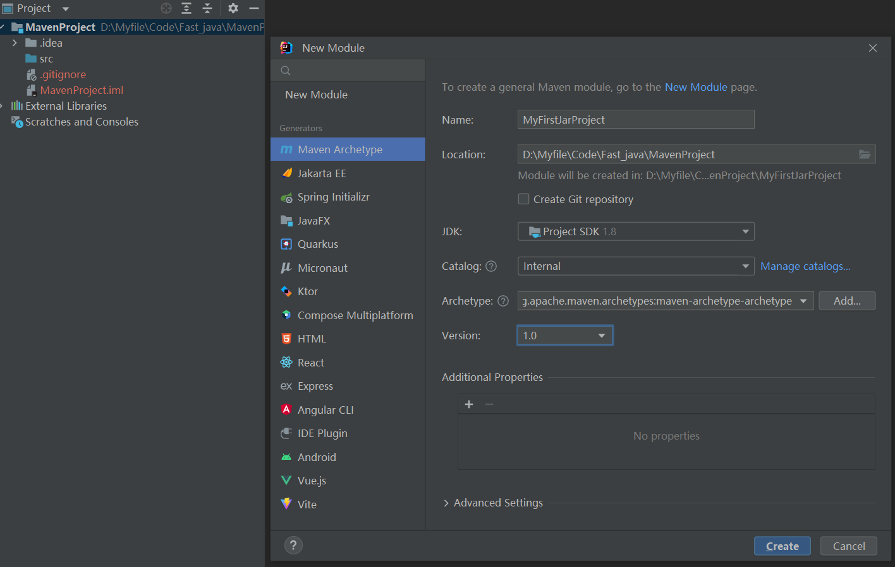

4. 此时可以看到Libraries中只有jdk1.8一个文件。回想之前连接数据库需要先建一个Lib文件夹，再把jdbc jar包导入Lib包。现在使用Maven项目只需要直接在pom.xml中指定jar的左边即可
5. [找到mysql的jar包坐标]([Maven Repository: mysql » mysql-connector-java » 8.0.28](https://mvnrepository.com/artifact/mysql/mysql-connector-java/8.0.28))

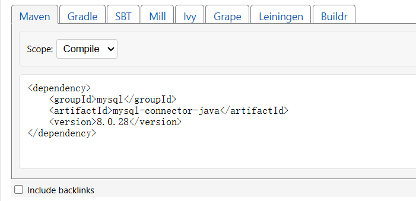

6. 放到pom.xml中，发现报错，需在外面添加<dependencies>标签  

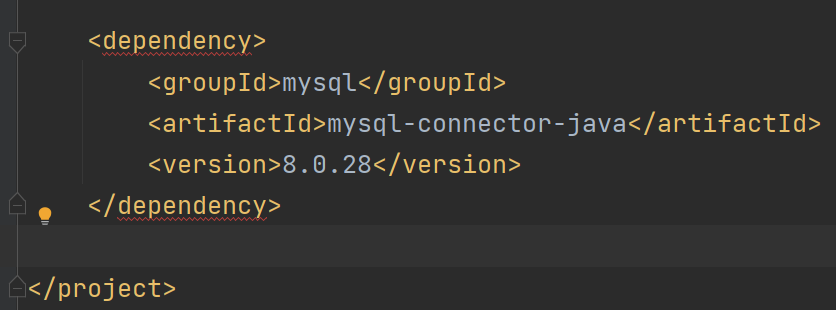

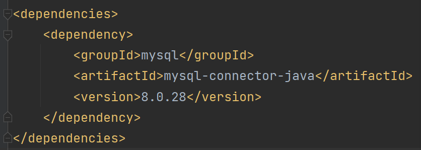

7. ==需要什么jar包就去Maven仓库中找到坐标，放到POM.xml的<dependencies>标签下就可以==
8. 此时配置好后，发现Libraries路劲下除了jdk1.8,还多了其他文件

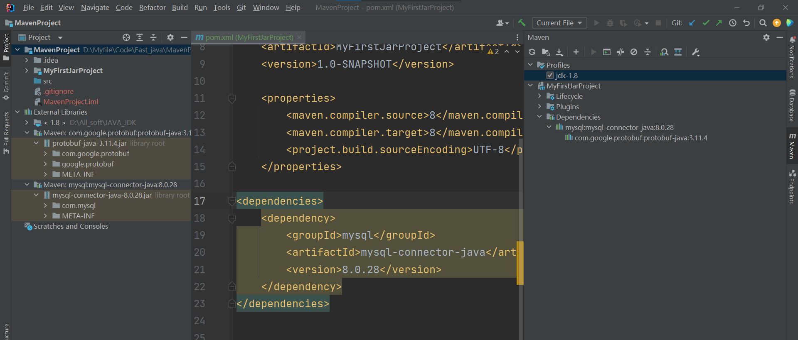

9. 项目结构发生变化

1. main下的java--------放项目源码文件
2. main下的resource------放配置文件如.xml;.project
3. test下的java ------项目做测试的代码文件；该路径下也可以创建resource放测试所需配置文件

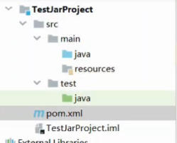

10. 在test中编写文件，操作数据库，测试后可以正常使用。


