# Java快速

## 一、maven项目

### Maven引入

Maven是使用Java语言编写的基于项目对象模型（POM）**项目管理工具软件**。开发者可以通过一小段描述信息来管理项目构建、报告和文档。使用Maven可以更好的帮助我们完成项目的管理。

一句话总结：使用Maven可以更好的管理项目依赖库Lib(.jar文件)

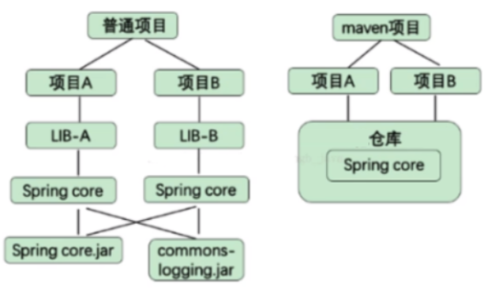

### Maven基础配置

1. [maven仓库搜索需要的jar]([Maven Repository: mysql](https://mvnrepository.com/search?q=mysql))

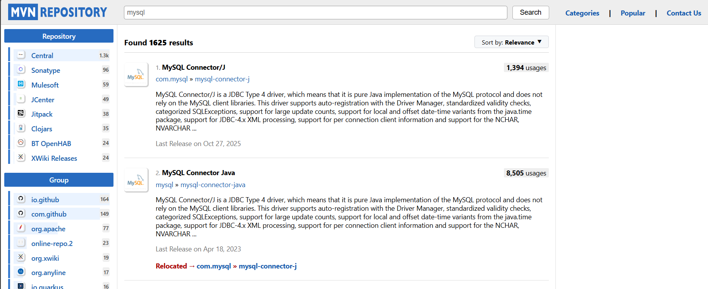

2. 选一个用的多的版本

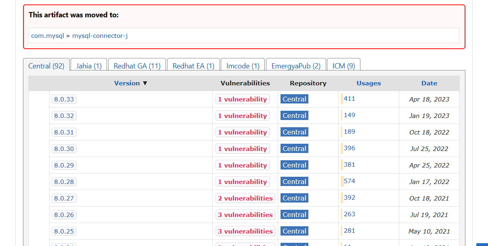

3. 往下滑就可以看到Maven 的坐标

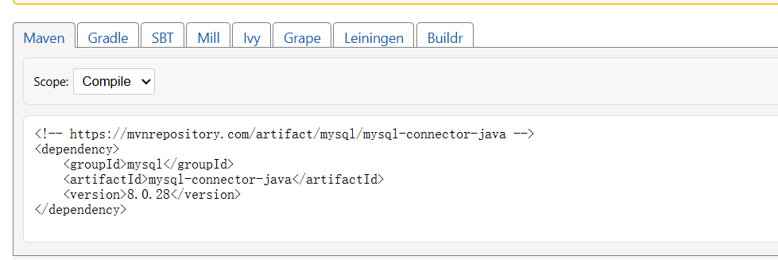

5. [下载Maven]([Download Apache Maven – Maven](https://maven.apache.org/download.cgi))

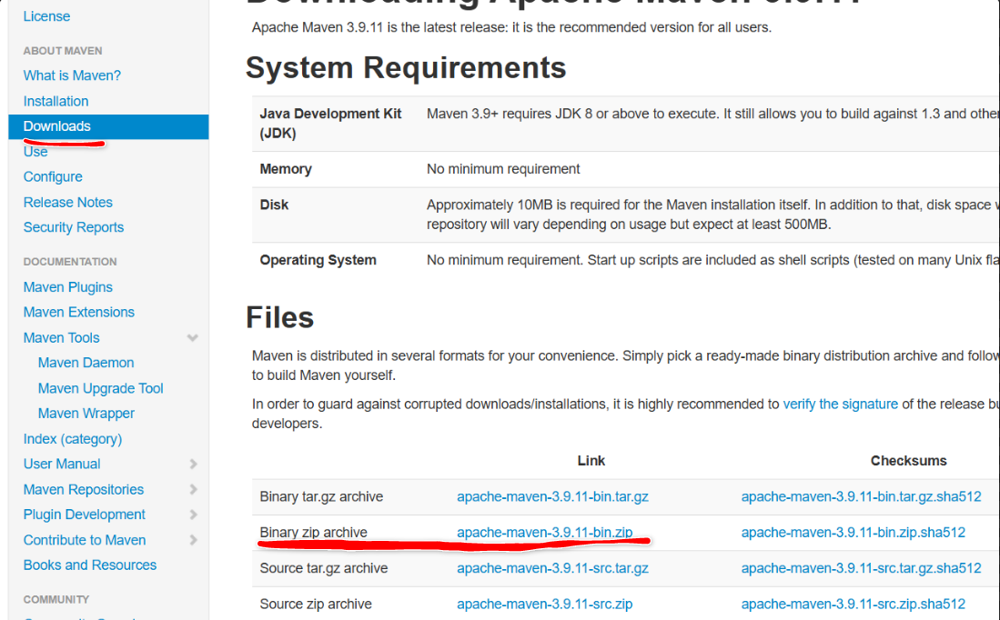

6. 解压下载好的Maven,打开settings.xml配置本地仓库

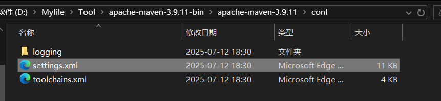

7. 随便选择一个目录作为本地仓库，可以使用我提供的本地仓库
8. 在 settings.xml 配置文件中指定本地仓库位置

```
<localRepository>D:/repository</localRepository>
```

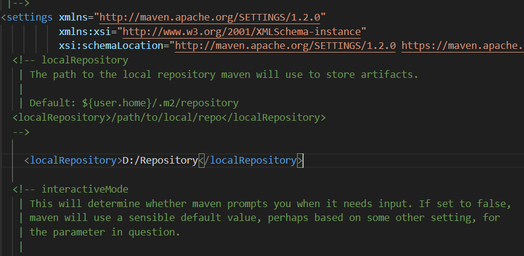

9. 配置镜像仓库

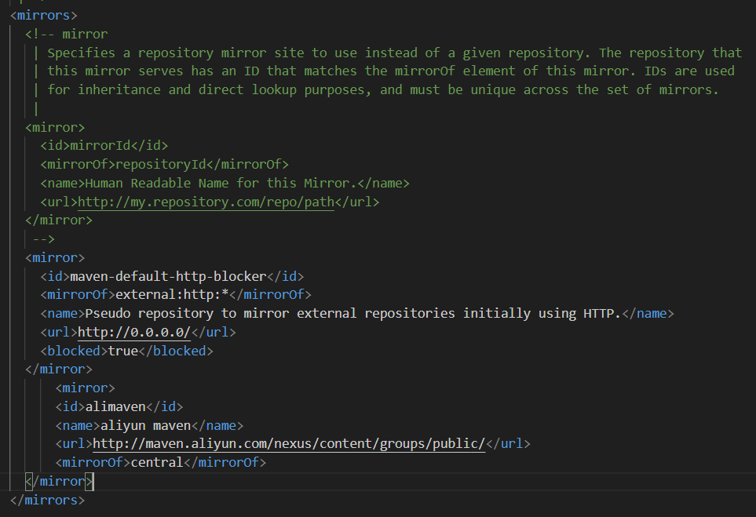

10. 配置JDK(注意jdk版本) 此处用JDK17

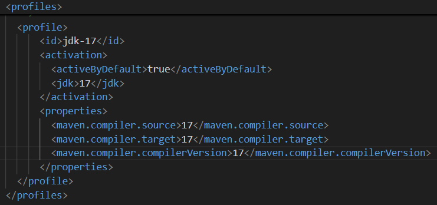

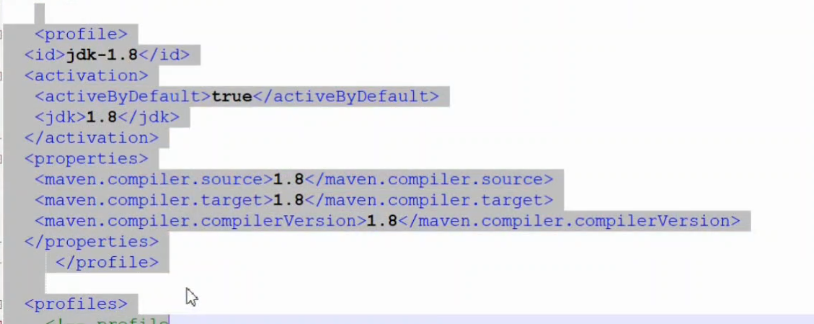

注意：高版本如果不匹配，则降低版本

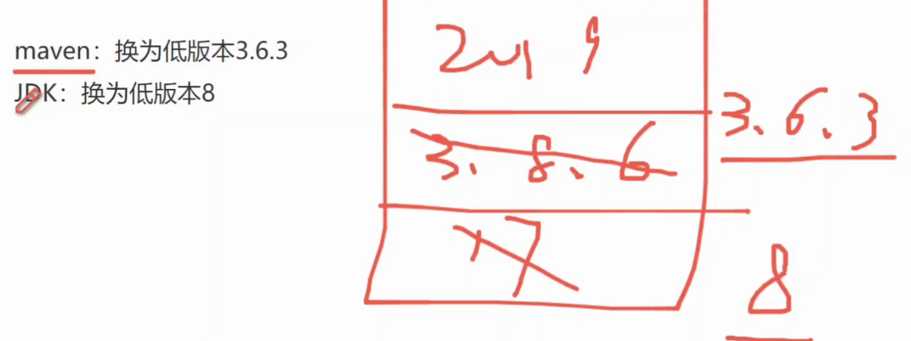

### 创建Maven项目

1. IDEA新建一个空项目，在空项目再创建模块TestMaven
2. 进行配置

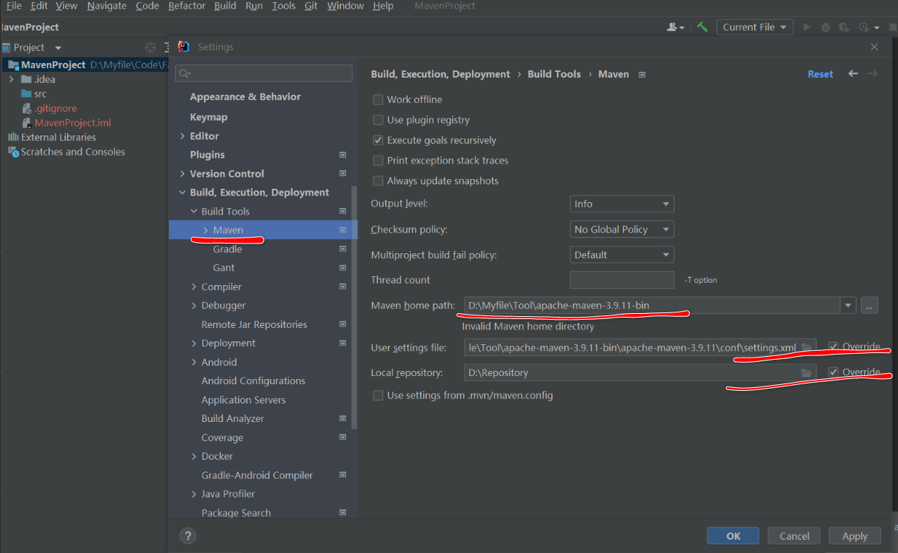

3. 新建一个模块，选择Maven,填写项目的坐标

   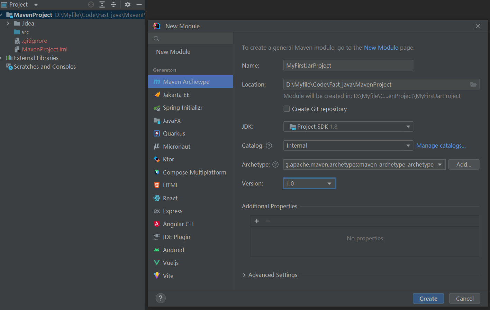

4. 此时可以看到Libraries中只有jdk1.8一个文件。回想之前连接数据库需要先建一个Lib文件夹，再把jdbc jar包导入Lib包。现在使用Maven项目只需要直接在pom.xml中指定jar的左边即可
5. [找到mysql的jar包坐标]([Maven Repository: mysql » mysql-connector-java » 8.0.28](https://mvnrepository.com/artifact/mysql/mysql-connector-java/8.0.28))

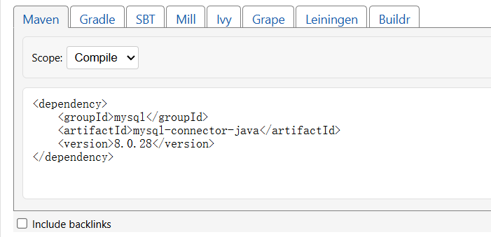

6. 放到pom.xml中，发现报错，需在外面添加<dependencies>标签  

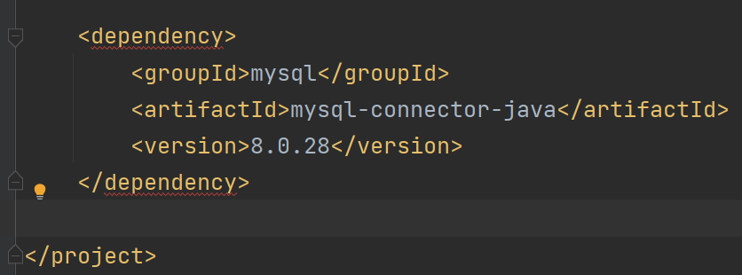

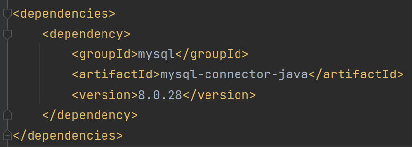

7. ==需要什么jar包就去Maven仓库中找到坐标，放到POM.xml的<dependencies>标签下就可以==
8. 此时配置好后，发现Libraries路劲下除了jdk1.8,还多了其他文件

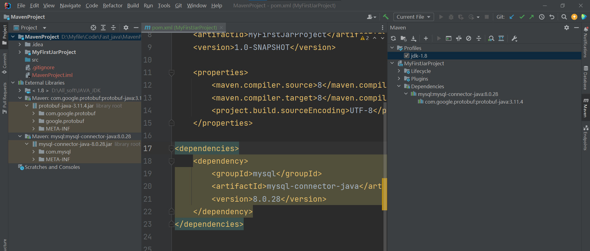

9. 项目结构发生变化

1. main下的java--------放项目源码文件
2. main下的resource------放配置文件如.xml;.project
3. test下的java ------项目做测试的代码文件；该路径下也可以创建resource放测试所需配置文件

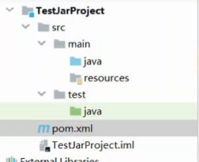

10. 在test中编写文件，操作数据库，测试后可以正常使用。

## 二、MyBatis框架

### 框架的引入

- 框架出现的意义

  - 重复/基础代码封装，同时添加额外功能。
  - 释放程序员写代码精力，更关注业务层面。
  - 框架是半成品。

- 框架优缺点

  - 优点

    - ##### 更好用

    - ##### 更强大

    - ##### 开发周期更短

  - 缺点

    - ##### 更多的学习成本

    - ##### 初学者更容易出错

    - ##### 对于初学者，出了错误更难解决

- **常见Java框架分类：**

  - 1）持久层框架（连数据库）。**MyBatis**、Hibernate、Spring Data、iBatis。

    （2）MVC框架。**Spring MVC**、Struts1、Struts2。

    （3）项目管理框架。**Spring Framework、Spring Boot**。

    （4）微服务框架。Spring Cloud。

    （5）权限管理框架。Spring Security、Shiro。

### MyBatis框架

#### MyBatis是持久层框架

**持久层**是分层开发中专门负责访问数据源的一层，Java项目中每一层都有自己的作用，持久层的作用就是访问数据源，把访问数据源的代码和业务逻辑代码分离开，有利于后期维护和团队分工开发。同时也增加了数据访问代码的复用性。

#### MyBatis是ORM框架

**ORM**(Object/Relation Mapping)，中文名称：对象/关系 映射。是一种解决数据库发展和面向对象编程语言发展不匹配问题而出现的技术。

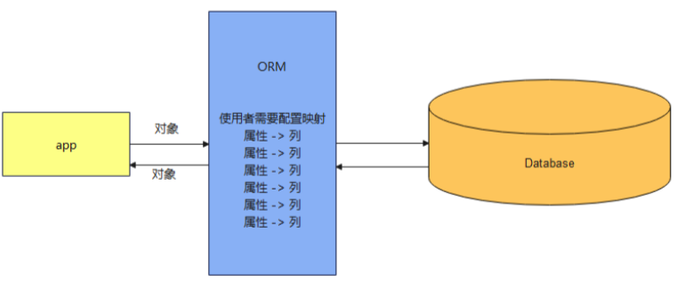


#### 搭建第一个MyBatis框架

1. 创建数据库表
2. 创建Maven项目
3. 添加依赖
4. 创建MyBatis全局配置文件（mybaits中文网址：https://mybatis.org/mybatis-3/zh/getting-started.html）
5. 创建实体类
6. 创建映射文件，在核心配置文件中进行扫描
7. 编写测试类，启动项目


1. 创建数据库表
2. 创建Maven项目

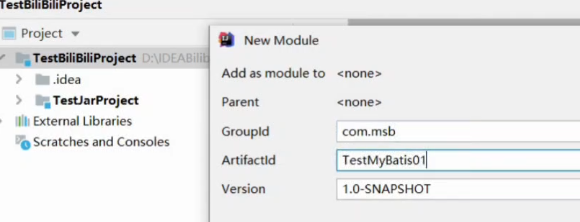

3. 添加依赖

- 需要导入两个依赖 ，一个MyBatis依赖，一个JDBC
  - [找到mysql的jar包坐标]([Maven Repository: mysql » mysql-connector-java » 8.0.28](https://mvnrepository.com/artifact/mysql/mysql-connector-java/8.0.28))和[MyBatis坐标]([Maven Repository: org.mybatis » mybatis » 3.5.16](https://mvnrepository.com/artifact/org.mybatis/mybatis/3.5.16)),然后放到pom.xml中

4. 创建MyBatis全局配置文件（mybaits中文网址：[MyBatis 3 | 入门 – mybatis](https://mybatis.org/mybatis-3/zh_CN/getting-started.html)）

   - 添加配置文件，在src/main/resources下添加mybatis.xml

     - ```xml
       <?xml version="1.0" encoding="UTF-8" ?>   <!--文档头-->
       <!--添加约束，标签按照约束来写(configuration作为根标签)，首次添加报错需要alt + enter 进行一个下载-->
       <!DOCTYPE configuration
               PUBLIC "-//mybatis.org//DTD Config 3.0//EN"
               "https://mybatis.org/dtd/mybatis-3-config.dtd">
       <configuration>
           <environments default="mysql">
               <environment id="mysql">
                   <transactionManager type="JDBC"></transactionManager>
                   <dataSource type="POOLED">
       <!--                前面的name需要按照规定好的来写，将value替换为自己需要的就可以-->
                       <property name="driver" value="com.mysql.cj.jdbc.Driver"/>
       <!--                注意：下面的 & 需要替换为 &amp; -->
                       <property name="url" value="jdbc:mysql://127.0.0.1:3306/msb?useSSL=false&amp;useUnicode=true&amp;characterEncoding=UTF-8&amp;serverTimezone=Asia/Shanghai&amp;allowPublicKeyRetrieval=true"/>
                       <property name="username" value="root"/>
                       <property name="password" value="root"/>
                   </dataSource>
               </environment>
       
       <!--        可以配置多个数据库，需要使用哪个数据库就在“<environments default="mysql">”中指定-->
       <!--        <environment id="oracle">-->
       <!--            <transactionManager type=""></transactionManager>-->
       <!--            <dataSource type=""></dataSource>-->
       <!--        </environment>-->
       
           </environments>
           <mappers>
               <mapper resource="org/mybatis/example/BlogMapper.xml"/>
           </mappers>
       </configuration>
       ```

       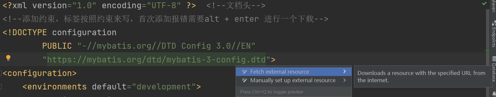

5. 创建实体类

在java下创建pakege:com.rao.pojo  在该路径下创建实体类Book，（属性名字及类型需要和数据库中保持一致）

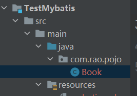

6. 创建映射文件（对数据库操作的SQL信息），在核心配置文件mybatis.xml中进行扫描

- 映射文件一般放在单独目录下，在resources下新建文件夹mapper，新建BookMapper.xml文件

- 对照下图写xml

- 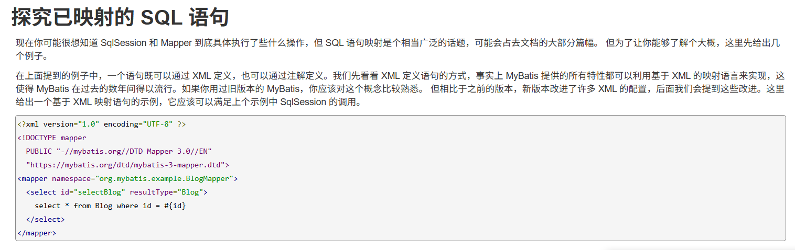

- ```xml
  <?xml version="1.0" encoding="UTF-8" ?>
  <!DOCTYPE mapper
          PUBLIC "-//mybatis.org//DTD Mapper 3.0//EN"
          "https://mybatis.org/dtd/mybatis-3-mapper.dtd">
  <mapper namespace="a.b">  <!--此处的命名空间可随意写 -->
  <!--    id相当于查询的方法名 public List selectAllBooks(参数){方法体} -->
  <!--    resultType相当于返回类型，返回的是Book的集合(list)，
  但只需要写集合中的内容是什么.即：Book,需要指定路径，即com.rao.pojo.Book-->
      <select id="selectAllBooks" resultType="com.rao.pojo.Book">
          select * from t_book
      </select>
  </mapper>
  ```

- 在核心配置文件mybatis.xml中进行扫描 
  - 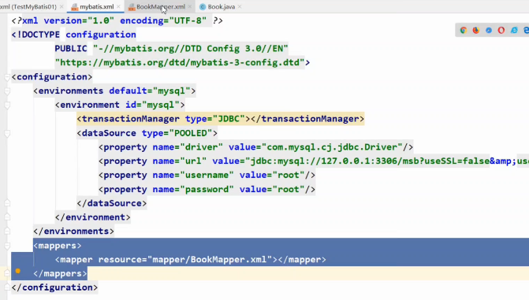

7. 编写测试类，启动项目

```java
package com.rao.test;

public class Test {
    public static void main(String[] args) throws IOException {
        //指定核心配置文件的路径
//        String resource = "org/mybatis/example/mybatis-config.xml";
        String resource = "mybatis.xml";
        //获取加载配置文件的输入流
        InputStream inputStream = Resources.getResourceAsStream(resource);
        //加载配置文件，创建工厂类
        SqlSessionFactory sqlSessionFactory = new SqlSessionFactoryBuilder().build(inputStream);

        //通过工厂类获取一个会话
        SqlSession sqlSession = sqlSessionFactory.openSession();
        //执行查询
        List list = sqlSession.selectList("a.b.selectAllBooks");
        //遍历
        for (int i = 0; i < list.size(); i++) {
            Book b = (Book)list.get(i);
            System.out.println(b.getBookname() + "---" + b.getAuthor());
        }
        sqlSession.close();
    }
}

```

#### 别名设置

存在的问题：如果有多个查询，则resultType取值“com.rao.pojo.Book”写起来就比较麻烦

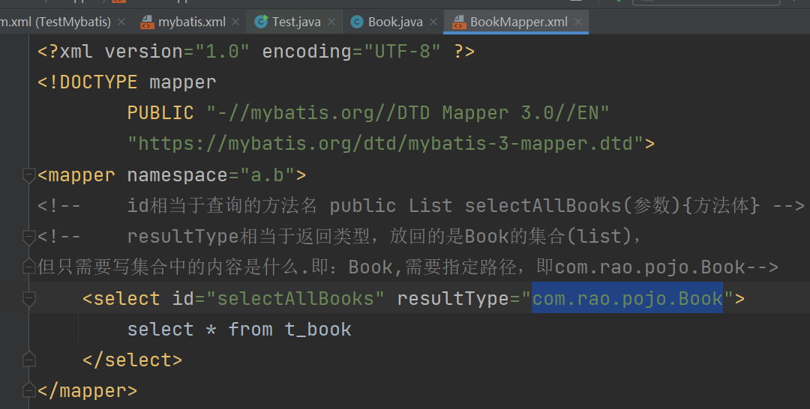

MyBatis提供了别名机制可以对某个类起别名或给某个包下所有类起别名，简化resultType取值的写法。

在核心配置文件（mybatis.xml）中，通过`<typeAlias>`标签明确设置类型的别名。

- type:类型全限定路径
- alias:别名名称

```xml
    <typeAliases>
        <typeAlias type="com.rao.pojo.Book" alias="b"></typeAlias>
    </typeAliases>
```

注意<typeAliases>不能放置在最后，每个标签的放置都有顺序要求的

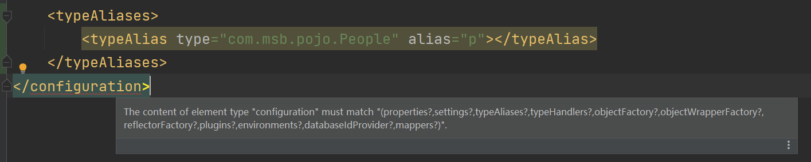

当类个数较多时，明确指定别名工作量较大，可以通过`<package>`标签指定包下全部类的别名。指定后所有类的别名就是类名。（也不区分大小写）

```xml
<typeAliases>
        <package name="com.msb.pojo"/>
</typeAliases>
```

PS:明确指定别名和指定包的方式可以同时存在

#### 内置别名

MyBatis框架中内置了一些常见类型的别名。这些别名不需要配置

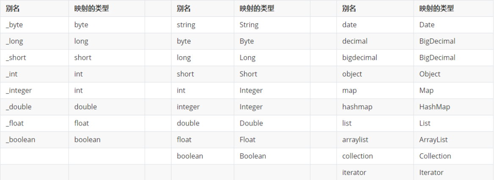

#### 属性文件配置

在mybatis.xml核心配置文件中，<property> 这部分配置信息还可以单独摘出来（达到解耦的作用），一般放在resources目录下“db.properties”，文件类型必须是.properties

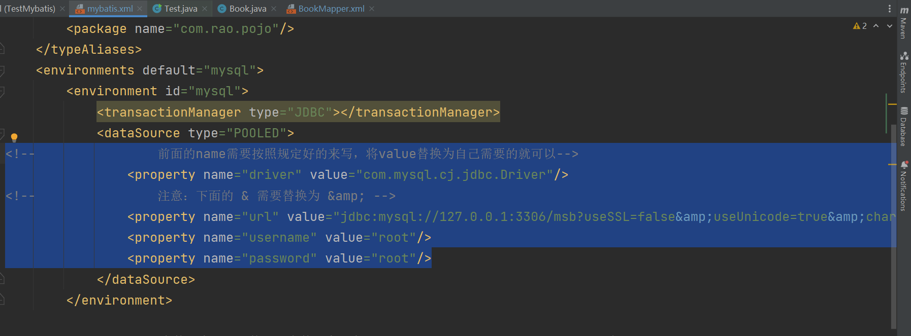

MyBatis支持加载属性文件（.properties文件），可以通过在属性文件中配置数据库连接属性然后加载。这种方式要比直接写稍微麻烦一点点，但是却把所有的数据库连接书写到了统一的文件中，以后查看或修改时更加方便。

在src/main/resources目录中创建db.properties文件：

```properties
url=jdbc:mysql://localhost:3306/ssm?useUnicode=true&characterEncoding=utf-8&useSSL=false&serverTimezone=GMT%2B8&allowPublicKeyRetrieval=true

url=jdbc:mysql://127.0.0.1:3306/msb?useSSL=false&useUnicode=true&characterEncoding=UTF-8&serverTimezone=Asia/Shanghai&allowPublicKeyRetrieval=true
driver=com.mysql.cj.jdbc.Driver
username=root
password=root

```

修改mybatis.cfg.xml文件，设置加载属性。 

```xml
<properties resource="db.properties"></properties>
```

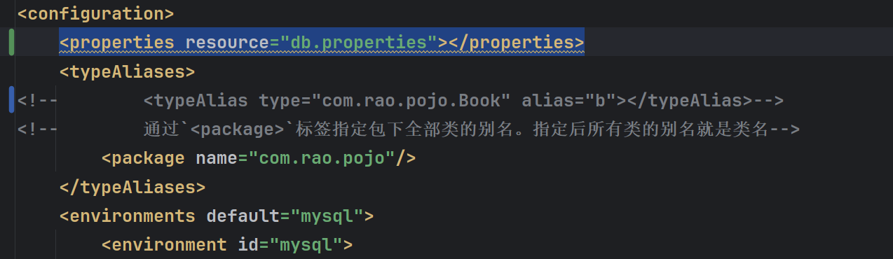

通过${key}获取属性文件中配置的值,如：

```xml
                <property name="driver" value="${driver}"/>
                <property name="url" value="${url}"/>
                <property name="username" value="${username}"/>
                <property name="password" value="${password}"/>
```

#### **MyBatis启动日志功能**

MyBatis框架内置日志工厂。日志工厂负责自动加载项目中配置的日志。MyBatis支持以下日志：

▢ SLF4J

▢ Apache Commons Logging

▢ Log4j 2

▢ **Log4j** (deprecated since 3.5.9)

▢ JDK logging

1. 在pom.xml中增加[log4j的依赖：]([Maven Repository: log4j » log4j » 1.2.17](https://mvnrepository.com/artifact/log4j/log4j/1.2.17))
2. 在resources中新建log4j.properties配置文件。名称必须叫这个名字，扩展名必须是.properties。

```properties
# log4j中定义的级别：fatal(致命错误) > error(错误) >warn(警告) >info(普通信息) >debug(调试信息)>trace(跟踪信息)
log4j.rootLogger = DEBUG , console

### console ###
log4j.appender.console = org.apache.log4j.ConsoleAppender
log4j.appender.console.Target = System.out
log4j.appender.console.layout = org.apache.log4j.PatternLayout
log4j.appender.console.layout.ConversionPattern = [%p] [%-d{yyyy-MM-dd HH\:mm\:ss}] %C.%M(%L) | %m%n
```

3. 如果说你只是想看sql执行过程，那么可以整体调高，局部降低：将整个日志级别调为ERROR，然后mapper.xml涉及的内容级别降低为TRACE。这样整体的多余信息不会输出，然后mapper.xml中的涉及内容会详细打印，log4j.properties加入：

```properties
# log4j.logger是固定的，a.b是命名空间的名字。
log4j.logger.a.b=TRACE
```

#### MyBatis接口绑定方案 **Mybatis_Interface02**

之前项目存在的问题

（1）方法不能直接调用

BookMapper.xml中的每一个<select>标签对应一个方法

```xml
<!-- BookMapper.xml-->
<mapper namespace="a.b">
    <select id="selectAllBooks" resultType="book">
        select * from t_book
    </select>
</mapper>
```

每次使用需要将方法selectAllBooks作为一个参数传递给**sqlSession.selectList("a.b.selectAllBooks");**

当有多个<select>查询时就对应着多个方法，需要传递多个参数，使用不便

```java
//Test.java
 public static void main(String[] args) throws IOException {
        String resource = "mybatis.xml";
        InputStream inputStream = Resources.getResourceAsStream(resource);
        SqlSessionFactory sqlSessionFactory = new SqlSessionFactoryBuilder().build(inputStream);
        SqlSession sqlSession = sqlSessionFactory.openSession();
        //执行查询,此处"a.b.selectAllBooks"是BookMapper.xml中的ID，其中a.b是命名空间
        List list = sqlSession.selectList("a.b.selectAllBooks");
        for (int i = 0; i < list.size(); i++) {
            Book b = (Book)list.get(i);
            System.out.println(b.getName() + "---" + b.getAuthor() + "---" + b.getPrice());
        }
        sqlSession.close();
    }
```


（2）多个参数问题处理麻烦

```xml
<!-- BookMapper.xml-->
<mapper namespace="a.b">
    <select id="selectAllBooks" resultType="book">  
        <!--这里就需要传入两个参数，可以在Test.java的sqlSession.selectList()中传入参数-->   
        select * from t_book where id = **具体某个数值 and price > **具体某个数值  
    </select>
</mapper>
```

```java
List list = sqlSession.selectList("a.b.selectAllBooks");
//selectList源码如下
    <E> List<E> selectList(String statement);
    <E> List<E> selectList(String statement, Object parameter);
    <E> List<E> selectList(String statement, Object parameter, RowBounds rowBounds);
//传入其他参数需要将其封装成对象（Object parameter），比较麻烦
```

（3）项目没有规范可言，不利于面向接口编程思想。

```xml
<!-- BookMapper.xml--> 方法名字（selectAllBooks）和返回类型都是自己写，没有规范
<mapper namespace="a.b">
    <select id="selectAllBooks" resultType="book">
        select * from t_book
    </select>
</mapper>
```


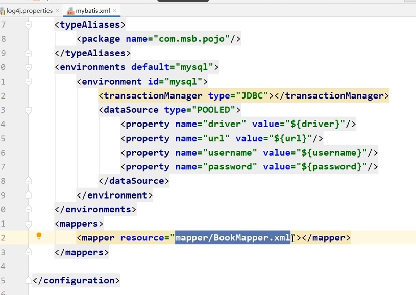

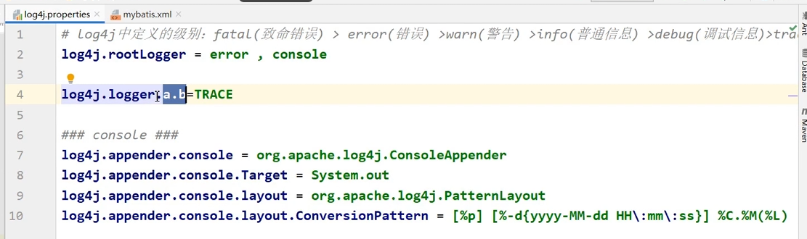

接口绑定方案

（1）创建新的Maven项目

（2）配置pom.xml

（3）配置全局配置文件(mybatis.xml)

（4）配置数据库属性文件(db.propertides)

（5）日志配置文件(log4j.properties)

（6）创建实体类(Book.java)

（7）创建接口(Bookmapper.java Interface类型)  

​	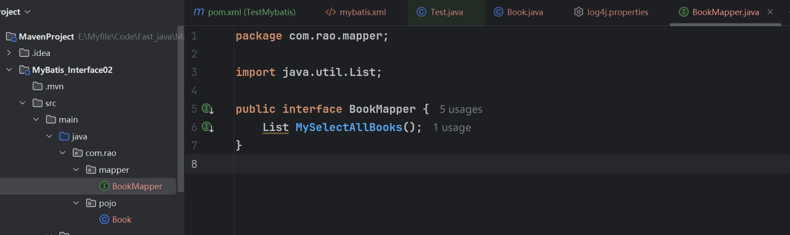

（8）创建映射文件（BookMapper.xml）：要求：namespace取值必须是接口的全限定路径、标签中的id属性值必须和方法名对应

此时相当于用BookMapper.xml（这个类）去实现了接口BookMapper

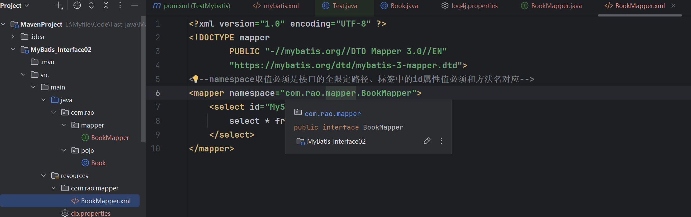

```xml
<!--BookMapper.xml-->
<?xml version="1.0" encoding="UTF-8" ?>
<!DOCTYPE mapper
        PUBLIC "-//mybatis.org//DTD Mapper 3.0//EN"
        "https://mybatis.org/dtd/mybatis-3-mapper.dtd">
<!--namespace取值必须是接口的全限定路径、标签中的id属性值必须和方法名对应-->
<mapper namespace="com.rao.mapper.BookMapper">
    <select id="MySelectAllBooks" resultType="Book">
        select * from t_book
    </select>
</mapper>
```

（9）编写测试类（通过动态代理模式）

```java
public static void main(String[] args) throws IOException {
        //指定核心配置文件的路径
//        String resource = "org/mybatis/example/mybatis-config.xml";
        String resource = "mybatis.xml";
        //获取加载配置文件的输入流
        InputStream inputStream = Resources.getResourceAsStream(resource);
        //加载配置文件，创建工厂类
        SqlSessionFactory sqlSessionFactory = new SqlSessionFactoryBuilder().build(inputStream);

        //通过工厂类获取一个会话
        SqlSession sqlSession = sqlSessionFactory.openSession();
        //使用了动态代理，BookMapper mapper（接口类型） = BookMapper的实现类
        BookMapper mapper = sqlSession.getMapper(BookMapper.class);
        List list = mapper.MySelectAllBooks();
        //遍历
        for (int i = 0; i < list.size(); i++) {
            Book b = (Book) list.get(i);
            System.out.println(b.getName() + "---" + b.getAuthor() + "---" + b.getPrice());
        }
        sqlSession.close();
    }
```

resources目录下，com.rao.mapper需要一级一级创建

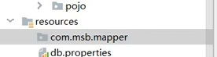

建议和接口名字保持一致

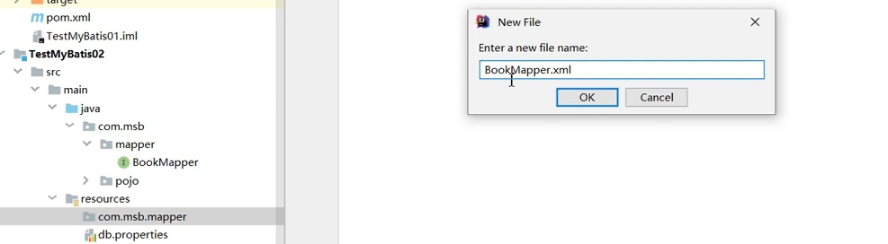

#### MyBatis参数传递

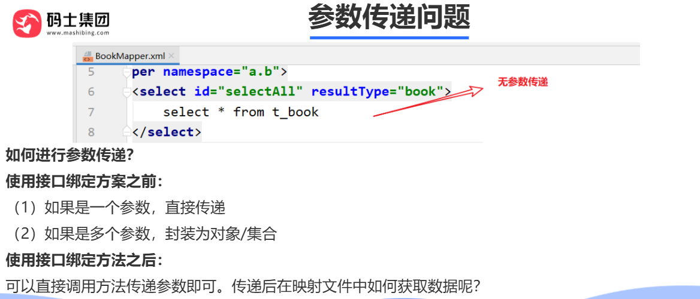

1. 多个纯参数（没有对象）

使用符号： **#{}**进行获取

{}中名字使用**规则**：

arg0、arg1、argM(M为从0开始的数字，和方法参数顺序对应)  或  param1、param2、paramN（N为从1开始的数字，和方法参数顺序对应）。

2. **一个参数且参数为对象**

使用符号： **#{}**进行获取

直接利用属性名即可

3. **多个参数且参数有对象**

使用符号： **#{}**进行获取

argM.属性名 或者 paramN.属性名

PS：argM. 或者 paramN. 不可以省略不写

```java
//BookMapper.java
public interface BookMapper {
    List MySelectAllBooks();
    Book selectBookByAuthorandName(String name,String suthor); //多个纯参数（没有对象）
    Book selectBookByAuthorandName2(Book book); //一个参数且参数为对象
    Book selectBookByAuthorandName3(String name,Book book);  //多个参数且参数有对象
}
```

```xml
<!--BookMapper.xml-->
<?xml version="1.0" encoding="UTF-8" ?>
<!DOCTYPE mapper
        PUBLIC "-//mybatis.org//DTD Mapper 3.0//EN"
        "https://mybatis.org/dtd/mybatis-3-mapper.dtd">
<!--namespace取值必须是接口的全限定路径、标签中的id属性值必须和方法名对应-->
<mapper namespace="com.rao.mapper.BookMapper">
    <select id="MySelectAllBooks" resultType="Book">
        select * from t_book
    </select>
    <select id="selectBookByAuthorandName" resultType = "Book">
<!--        下面两种方式等效，arg0,param1  前者从0开始，后者从1开始-->
<!--        多个纯参数，直接使用argM  或者 paramN-->
<!--        select * from t_book where name =#{arg0} and author =#{arg1}-->
        select * from t_book where name =#{param1} and author =#{param2}
    </select>
<!--一个参数且参数为对象,直接利用属性名即可-->
    <select id="selectBookByAuthorandName2" resultType = "Book">
        select * from t_book where name =#{name} and author =#{author}
    </select>
<!--多个参数且参数有对象,非对象类型的参数直接arg/param ,对象类型的参数使用argM.属性名-->
    <select id="selectBookByAuthorandName3" resultType = "Book">
        select * from t_book where name =#{param1} and author =#{param2.author}
    </select>
</mapper>
```

```java
//Test_canshu.java
package com.rao.test;
public class Test_cangshu {
    public static void main(String[] args) throws IOException {
        //指定核心配置文件的路径
//        String resource = "org/mybatis/example/mybatis-config.xml";
        String resource = "mybatis.xml";
        //获取加载配置文件的输入流
        InputStream inputStream = Resources.getResourceAsStream(resource);
        //加载配置文件，创建工厂类
        SqlSessionFactory sqlSessionFactory = new SqlSessionFactoryBuilder().build(inputStream);
        //通过工厂类获取一个会话
        SqlSession sqlSession = sqlSessionFactory.openSession();
        //使用了动态代理，BookMapper mapper（接口类型） = BookMapper的实现类
        BookMapper mapper = sqlSession.getMapper(BookMapper.class);

//        多个纯参数
//        Book book = mapper.selectBookByAuthorandName("史记","无名");

//      一个参数且参数为对象
//        Book b = new Book();
//        b.setName("史记");
//        b.setAuthor("无名");
//        Book book = mapper.selectBookByAuthorandName2(b);

//        一个参数且参数为对象
        Book b2 = new Book();
        b2.setAuthor("无名");
        Book book = mapper.selectBookByAuthorandName3("史记",b2);

        System.out.println(book.getName());

        sqlSession.close();
    }
}
```

#### MyBatis_增删改操作

```java
//Bookmapper.java
public interface BookMapper {
    List MySelectAllBooks();
    Book selectBookByAuthorandName(String name,String suthor); //多个纯参数（没有对象）
    Book selectBookByAuthorandName2(Book book); //一个参数且参数为对象
    Book selectBookByAuthorandName3(String name,Book book);  //多个参数且参数有对象
    int insertBook(Book book);//添加书籍操作，返回值为int类型，代表影响的条数
    int deleteBookByName(String name);//通过书名删除书籍
    int updateBook(int id);//通过ID来查找对应书籍并更新书籍
}
```

```xml
<!--Bookmapper.xml-->
<?xml version="1.0" encoding="UTF-8" ?>
<!DOCTYPE mapper
        PUBLIC "-//mybatis.org//DTD Mapper 3.0//EN"
        "https://mybatis.org/dtd/mybatis-3-mapper.dtd">
<!--namespace取值必须是接口的全限定路径、标签中的id属性值必须和方法名对应-->
<mapper namespace="com.rao.mapper.BookMapper">
    <select id="MySelectAllBooks" resultType="Book">
        select * from t_book
    </select>
    <select id="selectBookByAuthorandName" resultType = "Book">
<!--        下面两种方式等效，arg0,param1  前者从0开始，后者从1开始-->
<!--        多个纯参数，直接使用argM  或者 paramN-->
<!--        select * from t_book where name =#{arg0} and author =#{arg1}-->
        select * from t_book where name =#{param1} and author =#{param2}
    </select>
<!--一个参数且参数为对象,直接利用属性名即可-->
    <select id="selectBookByAuthorandName2" resultType = "Book">
        select * from t_book where name =#{name} and author =#{author}
    </select>
<!--多个参数且参数有对象,非对象类型的参数直接arg/param ,对象类型的参数使用argM.属性名-->
    <select id="selectBookByAuthorandName3" resultType = "Book">
        select * from t_book where name =#{param1} and author =#{param2.author}
    </select>

<!--    增加书籍-->
    <insert id="insertBook">
        insert into t_book (id,name,author,price) values (#{id},#{name},#{author},#{price})
    </insert>

<!--    删除书籍-->
    <delete id="deleteBookByName">
        delete from t_book where name = #{param1}
    </delete>

    <!--    更新书籍-->
    <delete id="updateBook">
        update t_book set price = 9.9 where id = #{param1}
    </delete>
</mapper>
```

```java
//Test_canshu.java
package com.rao.test;

import com.rao.mapper.BookMapper;
import com.rao.pojo.Book;
import org.apache.ibatis.io.Resources;
import org.apache.ibatis.session.SqlSession;
import org.apache.ibatis.session.SqlSessionFactory;
import org.apache.ibatis.session.SqlSessionFactoryBuilder;

import java.io.IOException;
import java.io.InputStream;
import java.util.List;

public class Test_cangshu {
    public static void main(String[] args) throws IOException {
        //指定核心配置文件的路径
//        String resource = "org/mybatis/example/mybatis-config.xml";
        String resource = "mybatis.xml";
        //获取加载配置文件的输入流
        InputStream inputStream = Resources.getResourceAsStream(resource);
        //加载配置文件，创建工厂类
        SqlSessionFactory sqlSessionFactory = new SqlSessionFactoryBuilder().build(inputStream);
        //通过工厂类获取一个会话
        SqlSession sqlSession = sqlSessionFactory.openSession();
        //使用了动态代理，BookMapper mapper（接口类型） = BookMapper的实现类
        BookMapper mapper = sqlSession.getMapper(BookMapper.class);

//        多个纯参数
//        Book book = mapper.selectBookByAuthorandName("史记","无名");

//      一个参数且参数为对象
//        Book b = new Book();
//        b.setName("史记");
//        b.setAuthor("无名");
//        Book book = mapper.selectBookByAuthorandName2(b);

//        一个参数且参数为对象
//        Book b2 = new Book();
//        b2.setAuthor("无名");
//        Book book = mapper.selectBookByAuthorandName3("史记",b2);
//
//        System.out.println(book.getName());

//        插入书籍
//        Book b3 = new Book(5, "红楼梦", "曹雪芹", 150.3);
//        int n = mapper.insertBook(b3);
//        if(n>0){
//            System.out.println("插入数据成功！n = " + n);
//        }

//        删除红高粱这本书
//        int n = mapper.deleteBookByName("红高粱");
//        if(n>0){
//            System.out.println("删除数据成功！n = " + n);
//        }

        //       更新ID= 5 这本书 价格为 9.9
        int n = mapper.updateBook(5);
        if(n>0){
            System.out.println("更新数据成功！n = " + n);
        }

        //提交事物
        sqlSession.commit();
        //关闭资源
        sqlSession.close();
    }
}
```

### 三、Spring框架

#### Spring引入

对比前面Mybatis，还存在一些问题

1. MyBatis.xml核心配置文件需要创建输入流和工厂类来加载，麻烦

```java
        //指定核心配置文件的路径
        String resource = "mybatis.xml";
        //获取加载配置文件的输入流
        InputStream inputStream = Resources.getResourceAsStream(resource);
        //加载配置文件，创建工厂类
        SqlSessionFactory sqlSessionFactory = new SqlSessionFactoryBuilder().build(inputStream);
        //通过工厂类获取一个会话
        SqlSession sqlSession = sqlSessionFactory.openSession();
        //使用了动态代理，BookMapper mapper（接口类型） = BookMapper的实现类
        BookMapper mapper = sqlSession.getMapper(BookMapper.class);
```

Spring的优势：方便解耦，简化开发，控制反转

整合各种优秀的框架，例如SSM（Spring、Spring MVC、Mybatis）、不重复造轮子、

需要使用Spring所需的jar包（Maven出现已让jar包管理变得方便）

[Spring官网](spring.io)

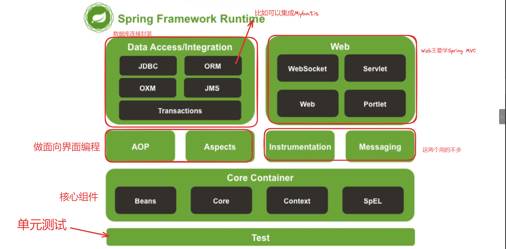

## **Spring IoC/DI 介绍**

IoC(Inversion of Control)中文名称：控制反转，也被称为DI(dependency injection )：依赖注入。注意：属于同一件事情的两个名称。

创建对象的权利,或者是控制的位置,由JAVA代码转移到spring容器,由spring的容器控制对象的创建,就是控制反转。

#### Spring项目-完成IoC/DI代码的实现

项目地址：D:\Myfile\Code\Fast_java\MavenProject\TestSpring01

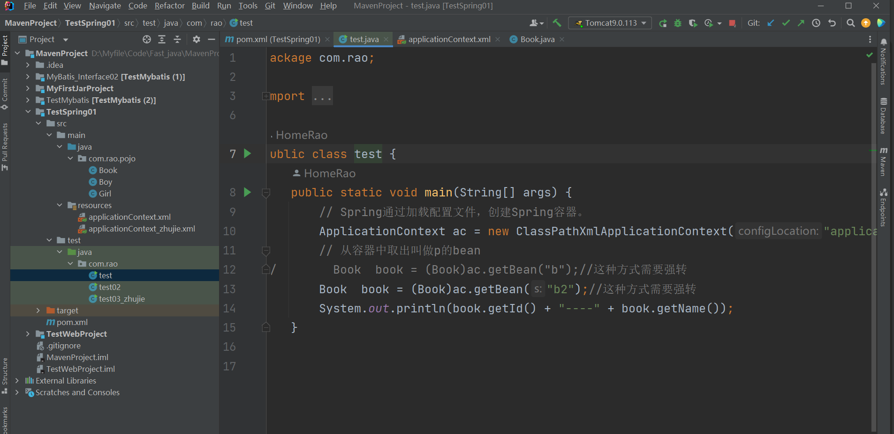

**1.创建项目，添加依赖**

创建普通Maven项目，在项目的pom.xml中添加Spring项目的最基本依赖。

Spring项目想要运行起来必须包含:

- spring-context.jar - 它依赖了下面的四个jar。

- spring-core.jar - 它依赖了spring-jcl.jar

- spring-aop.jar

- spring-expression.jar

- spring-beans.jar

- spring-jcl.jar

  所以在Maven中想要使用Spring框架只需要在项目中导入spring-context就可以了，其他的jar包根据Maven依赖传递性都可以导入进来。

  ```xml
  <dependencies>
          <dependency>
              <groupId>org.springframework</groupId>
              <artifactId>spring-context</artifactId>
              <version>5.3.16</version>
          </dependency>
      </dependencies>
  ```

**2.创建一个类** 

**3.创建Spring配置文件**

在src/main/resources下新建applicationContext.xml文件。

```xml
<?xml version="1.0" encoding="UTF-8"?>
<beans xmlns="http://www.springframework.org/schema/beans"
       xmlns:xsi="http://www.w3.org/2001/XMLSchema-instance"
       xsi:schemaLocation="http://www.springframework.org/schema/beans
        https://www.springframework.org/schema/beans/spring-beans.xsd">
    <!-- id:bean的名称   class：类型全限定路径 -->
    <bean id="p" class="com.zss.pojo.Person"></bean>
</beans>
```

**4.测试：Test.java**

```java
// Spring通过加载配置文件，创建Spring容器。
ApplicationContext ac = new ClassPathXmlApplicationContext("applicationContext.xml");
// 从容器中取出叫做p的bean
Person p2 = (Person)ac.getBean("p");//这种方式需要强转
```

#### 属性注入

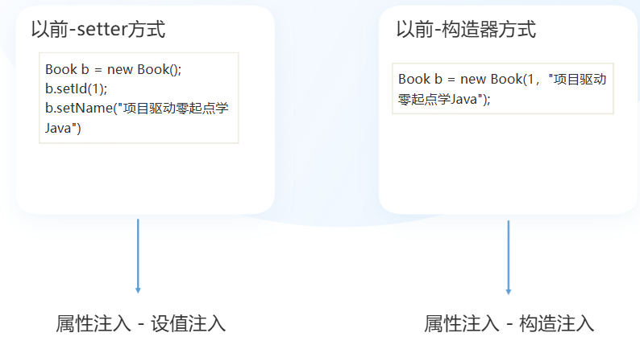

在**applicationContext.xml**中实现属性注入

设置属性的值：

方式1：value：简单数据类型（基本数据类型+String）直接设置:

方式2：ref：需要引用另一个bean的id。也就是说这个参数是一个类类型，且这个类的对象也被Spring容器管理。

1. **属性注入 - 设值注入**

```xml
   <bean id="b" class="com.msb.pojo.Book">
        <property name="id" value="1"></property>
        <property name="name" value="项目驱动零起点学Java"></property>
    </bean>
```

2. **属性注入 - 构造注入**

```xml
  <bean id="b" class="com.msb.pojo.Book">
        <constructor-arg name="id" value="1"></constructor-arg>
        <constructor-arg name="name" value="项目驱动零起点学Java"></constructor-arg>
    </bean>
```

注意：**属性为引用数据类型**的注入方式不同

```xml
    <bean id="girl" class="com.rao.pojo.Girl">
        <property name="name" value="丽丽"></property>
        <property name="age" value="18"></property>
<!--当属性的值是一个类类型，赋值不再使用value，而是用ref,需要引用另一个bean的id(此处为boy)-->
        <property name="boyfriend" ref="boy"></property>
    </bean>
```


### 四、Web项目

#### Java项目和web项目的区别

​		Java项目是由main()方法来开始的，直接依赖JVM就能被编译执行。Java项目不需要服务器。

​		Web项目中的Java文件是tomcat服务器来触发的，脱离了web服务器就无法启动。Web项目需要服务器。Web项目部署到服务器上，任何用户都可以通过浏览器来访问。将本地资源共享给外部访问。

#### 使用服务器

Tomcat服务器对Servlet，Jsp，JNDI，JavaMail有很好的的支持，并且这个Web容器是开源免费的。（Apache 开源免费）

#### **通过Maven构建项目**

1.Maven构建项目类型：

Java项目——>jar项目

Web项目——>war项目

2.创建Maven-war项目步骤：

（1）创建Maven项目，添加webapp模板

先勾选create from archetype前面的复选框。

然后选择org.apache.maven.archetypes:maven-archetype-webapp

新建项目的剩余步骤都点击Next按钮即可，和不使用原型时创建Maven项目类似。

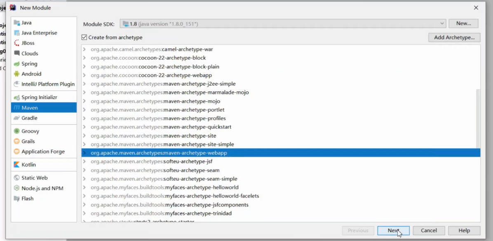

（2）注意pom.xml中是war项目

```xml
  <groupId>com.msb</groupId>
  <artifactId>TestWebProject</artifactId>
  <version>1.0-SNAPSHOT</version>
  <packaging>war</packaging>
<!--如果是java项目，则为<packaging>jar</packaging>,默认这条语句是省略-->
 <packaging>jar</packaging>

```


（3）观察目录结构与jar项目不同之处

（4）设置java目录为资源目录

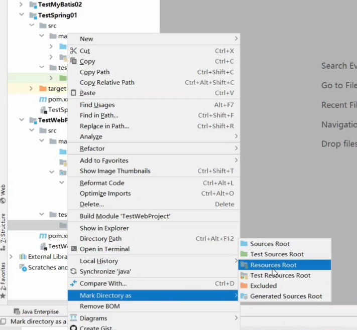

（5）添加tomcat（此方法是先下载Tomcat到**本地**计算机，然后在根据后续步骤添加到项目中）

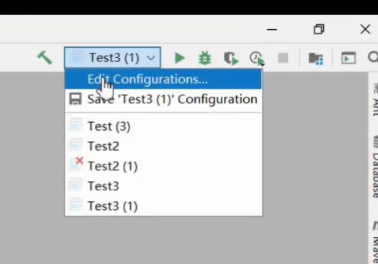

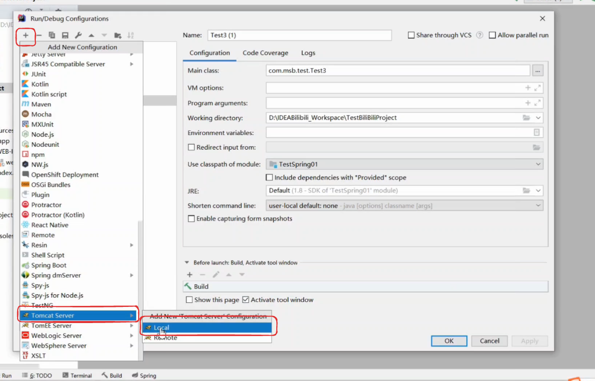

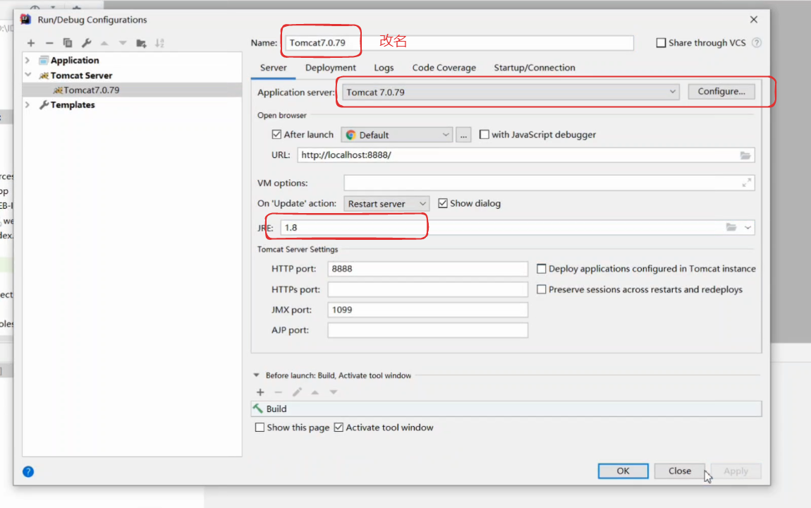

（6）将项目添加到tomcat中

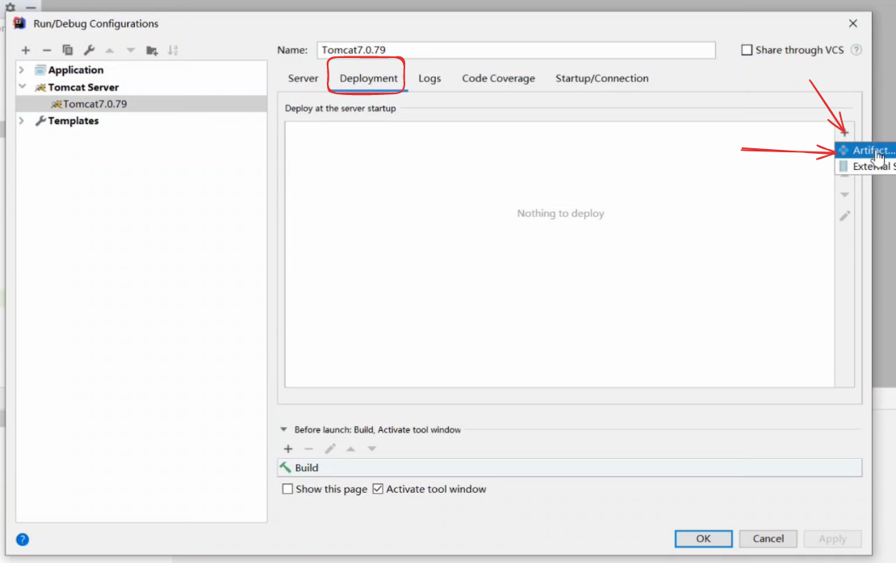

将Tomcat和项目做关联

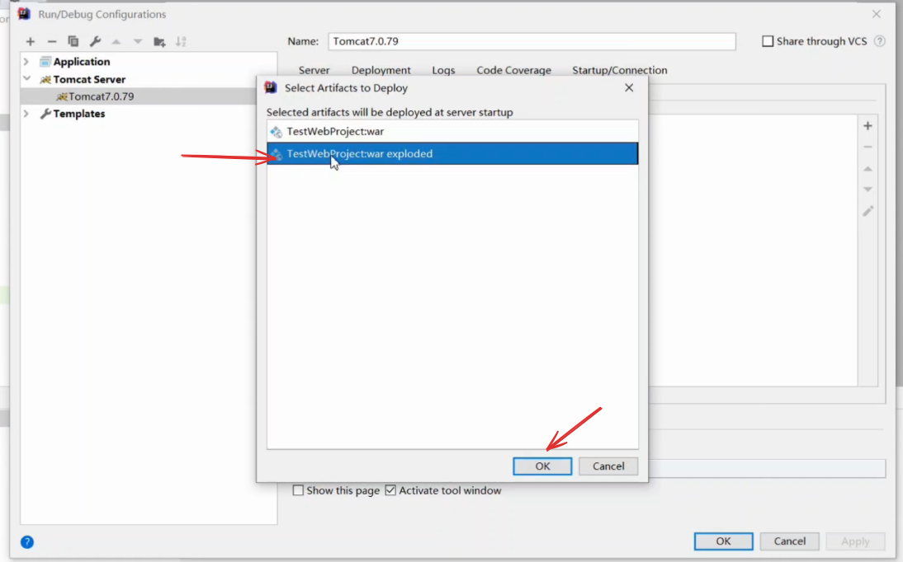

（7）运行

点击绿色箭头运行

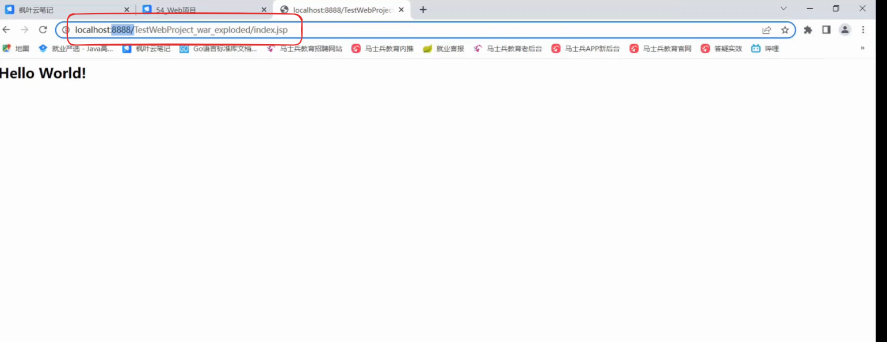

端口号可以自己改

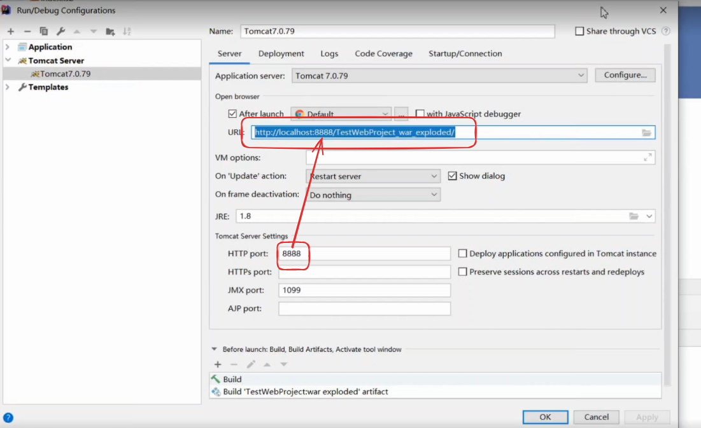

#### Tomcat插件

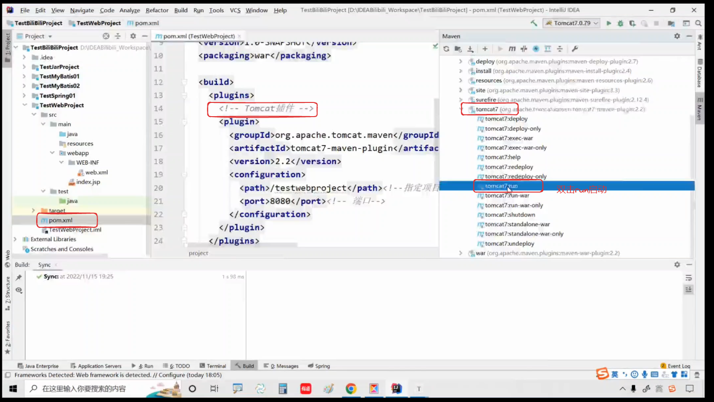

在项目的pom.xml中配置Tomcat插件，在<build>中添加Tomcat7插件：（配置之后，本地不用下载Tomcat也可以使用）

```xml
<?xml version="1.0" encoding="UTF-8"?>

<project xmlns="http://maven.apache.org/POM/4.0.0" xmlns:xsi="http://www.w3.org/2001/XMLSchema-instance"
         xsi:schemaLocation="http://maven.apache.org/POM/4.0.0 http://maven.apache.org/xsd/maven-4.0.0.xsd">
  <modelVersion>4.0.0</modelVersion>

  <groupId>com.msb</groupId>
  <artifactId>TestWebProject</artifactId>
  <version>1.0-SNAPSHOT</version>
  <packaging>war</packaging>
<!--如果是java项目，则为<packaging>jar</packaging>,默认这条语句是省略-->
  <build>
    <plugins>
      <!-- Tomcat插件 -->
      <plugin>
        <groupId>org.apache.tomcat.maven</groupId>
        <artifactId>tomcat7-maven-plugin</artifactId>
        <version>2.2</version>
        <configuration>
          <path>/testwebproject</path><!--指定项目的上下文路径-->
          <port>8080</port><!-- 端口-->
        </configuration>
      </plugin>
    </plugins>
  </build>

</project>

```

运行点击（5）tomcat7:run 

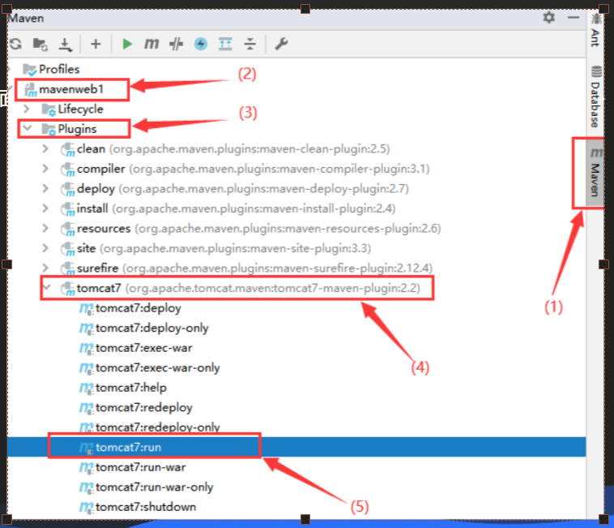

### 五、Spring MVC

项目地址 D:\Myfile\Code\Fast_java\MavenProject\TestSpringMVC

SpringMVC解决了项目**前端和后端的交互**

##### **SpringMVC环境搭建**

1. 创建maven-web项目
2. 补全目录
3. 添加依赖
4. 加入tomcat插件
5. 创建控制器类，跳转到index.jsp

```java
@Controller
public class FirstController {
    @RequestMapping("/first1")
    public String test1(){
        return "/index.jsp"; 
    }
}
```

6. 新建Spring MVC框架配置文件springmvc.xml

```xml
<!-- 扫描控制器类，千万不要把service等扫描进来，也千万不要在Spring配置文件扫描控制器类所在包 -->
    <context:component-scan base-package="com.msb.controller"></context:component-scan>
    <!-- 让Spring MVC的注解生效 ：@RequestMapping-->
    <mvc:annotation-driven></mvc:annotation-driven>
```

7. 编写web.xml内容  （可以理解为web项目的启动入口，该文档配置了其他的xml，这样才能识别到其他的xml）

```xml
<?xml version="1.0" encoding="UTF-8"?>
<web-app xmlns="http://xmlns.jcp.org/xml/ns/javaee"
         xmlns:xsi="http://www.w3.org/2001/XMLSchema-instance"
         xsi:schemaLocation="http://xmlns.jcp.org/xml/ns/javaee http://xmlns.jcp.org/xml/ns/javaee/web-app_4_0.xsd"
         version="4.0">
  <servlet>
    <servlet-name>springmvc</servlet-name>
    <servlet-class>org.springframework.web.servlet.DispatcherServlet</servlet-class>
    <init-param>
      <param-name>contextConfigLocation</param-name>
      <!-- springmvc.xml 名称自定义，只要和我们创建的配置文件的名称对应就可以了。 -->
      <param-value>classpath:springmvc.xml</param-value>
    </init-param>
    <!-- Tomcat启动立即加载Servlet，而不是等到访问Servlet才去实例化DispatcherServlet -->
    <!-- 配置上的效果：Tomcat启动立即加载Spring MVC框架的配置文件-->
    <load-on-startup>1</load-on-startup>
  </servlet>
  <servlet-mapping>
    <servlet-name>springmvc</servlet-name>
    <!-- /表示除了.jsp结尾的uri，其他的uri都会触发DispatcherServlet。此处前往不要写成 /* -->
    <url-pattern>/</url-pattern>
  </servlet-mapping>
</web-app>
```

##### SpringMVC接受请求参数

1. **获取普通参数**

获取普通参数，只需要在控制单元中提供与请求参数同名的方法参数即可，Spring MVC会自动进行类型转换。

```java
    //访问路径http://localhost:8887/test1   这是没有参数的
    @RequestMapping("/test1")
    public String test1(){
        return "index.jsp";
    }
```

```java
//这是带有name和age两个普通参数的    
//访问路径http://localhost:8887/testspringmvc/testParam?name=marry&age=18     
    //url中的name和age变量要和方法中的参数名对应
    @RequestMapping("/testParam")
    public String testParam(String name,int age){
        System.out.println(name + "----" + age);
        return "index.jsp";
    }
```

2. **使用类对象作为控制单元参数**

JavaBean：一个包含私有属性，getter/setter方法和无参构造方法的Java类。是不是感觉和实体类特别像。其实写法上和实体类相同。唯一区别是实体类是数据库层面的概念，类型中属性要和数据库字段对应。而JavaBean的属性是灵活的，不是必须和哪里对应的。

JavaBean是一个专业概念，可以简单点理解：使用类对象做为控制单元参数，接收请求参数。如果不是特别较真，狭义上可以认为JavaBean就是项目中的实体类。

在控制单元中放置一个类型对象，对象名称没有要求，只需要保证请求参数名和类的属性名相同就可以了。

```java
//访问路径http://localhost:8887/testspringmvc/testParam?name=marry&age=18
    //url中的name和age变量要和Person类中的变量名对应
    @RequestMapping("/testParam23") //这里面的路径"/testParam23"随便写，不要求和方法名一样
    public String testParam2(Person p){
        System.out.println(p.getName() + "----" + p.getAge());
        return "index.jsp";
    }
```


