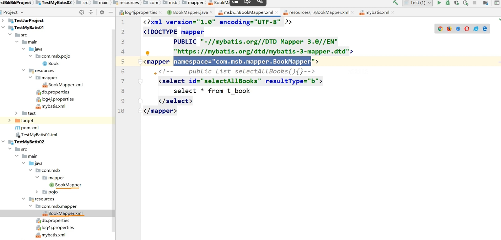
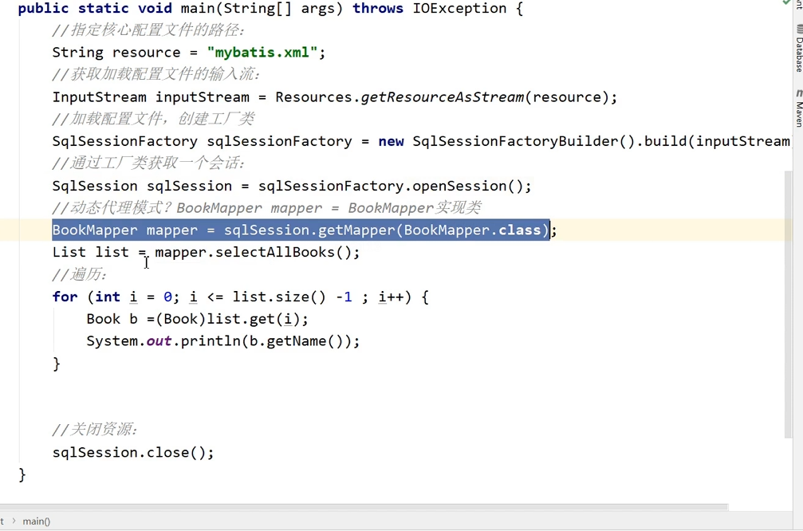

# Java快速

## 一、maven项目

### Maven引入

Maven是使用Java语言编写的基于项目对象模型（POM）**项目管理工具软件**。开发者可以通过一小段描述信息来管理项目构建、报告和文档。使用Maven可以更好的帮助我们完成项目的管理。

一句话总结：使用Maven可以更好的管理项目依赖库Lib(.jar文件)


### Maven基础配置

1. [maven仓库搜索需要的jar]([Maven Repository: mysql](https://mvnrepository.com/search?q=mysql))


2. 选一个用的多的版本


3. 往下滑就可以看到Maven 的坐标


5. [下载Maven]([Download Apache Maven – Maven](https://maven.apache.org/download.cgi))


6. 解压下载好的Maven,打开settings.xml配置本地仓库


7. 随便选择一个目录作为本地仓库，可以使用我提供的本地仓库
8. 在 settings.xml 配置文件中指定本地仓库位置

```
<localRepository>D:/repository</localRepository>
```


9. 配置镜像仓库


10. 配置JDK(注意jdk版本) 此处用JDK17


注意：高版本如果不匹配，则降低版本


### 创建Maven项目

1. IDEA新建一个空项目，在空项目再创建模块TestMaven
2. 进行配置


3. 新建一个模块，选择Maven,填写项目的坐标

   

4. 此时可以看到Libraries中只有jdk1.8一个文件。回想之前连接数据库需要先建一个Lib文件夹，再把jdbc jar包导入Lib包。现在使用Maven项目只需要直接在pom.xml中指定jar的左边即可
5. [找到mysql的jar包坐标]([Maven Repository: mysql » mysql-connector-java » 8.0.28](https://mvnrepository.com/artifact/mysql/mysql-connector-java/8.0.28))


6. 放到pom.xml中，发现报错，需在外面添加<dependencies>标签  


7. ==需要什么jar包就去Maven仓库中找到坐标，放到POM.xml的<dependencies>标签下就可以==
8. 此时配置好后，发现Libraries路劲下除了jdk1.8,还多了其他文件


9. 项目结构发生变化

1. main下的java--------放项目源码文件
2. main下的resource------放配置文件如.xml;.project
3. test下的java ------项目做测试的代码文件；该路径下也可以创建resource放测试所需配置文件


10. 在test中编写文件，操作数据库，测试后可以正常使用。

## 二、MyBatis框架

### 框架的引入

- 框架出现的意义

  - 重复/基础代码封装，同时添加额外功能。
  - 释放程序员写代码精力，更关注业务层面。
  - 框架是半成品。

- 框架优缺点

  - 优点

    - ##### 更好用

    - ##### 更强大

    - ##### 开发周期更短

  - 缺点

    - ##### 更多的学习成本

    - ##### 初学者更容易出错

    - ##### 对于初学者，出了错误更难解决

- **常见Java框架分类：**

  - 1）持久层框架（连数据库）。**MyBatis**、Hibernate、Spring Data、iBatis。

    （2）MVC框架。**Spring MVC**、Struts1、Struts2。

    （3）项目管理框架。**Spring Framework、Spring Boot**。

    （4）微服务框架。Spring Cloud。

    （5）权限管理框架。Spring Security、Shiro。

### MyBatis框架

#### MyBatis是持久层框架

**持久层**是分层开发中专门负责访问数据源的一层，Java项目中每一层都有自己的作用，持久层的作用就是访问数据源，把访问数据源的代码和业务逻辑代码分离开，有利于后期维护和团队分工开发。同时也增加了数据访问代码的复用性。

#### MyBatis是ORM框架

**ORM**(Object/Relation Mapping)，中文名称：对象/关系 映射。是一种解决数据库发展和面向对象编程语言发展不匹配问题而出现的技术。


#### 搭建第一个MyBatis框架

1. 创建数据库表
2. 创建Maven项目
3. 添加依赖
4. 创建MyBatis全局配置文件（mybaits中文网址：https://mybatis.org/mybatis-3/zh/getting-started.html）
5. 创建实体类
6. 创建映射文件，在核心配置文件中进行扫描
7. 编写测试类，启动项目


1. 创建数据库表
2. 创建Maven项目


3. 添加依赖

- 需要导入两个依赖 ，一个MyBatis依赖，一个JDBC
  - [找到mysql的jar包坐标]([Maven Repository: mysql » mysql-connector-java » 8.0.28](https://mvnrepository.com/artifact/mysql/mysql-connector-java/8.0.28))和[MyBatis坐标]([Maven Repository: org.mybatis » mybatis » 3.5.16](https://mvnrepository.com/artifact/org.mybatis/mybatis/3.5.16)),然后放到pom.xml中

4. 创建MyBatis全局配置文件（mybaits中文网址：[MyBatis 3 | 入门 – mybatis](https://mybatis.org/mybatis-3/zh_CN/getting-started.html)）

   - 添加配置文件，在src/main/resources下添加mybatis.xml

     - ```xml
       <?xml version="1.0" encoding="UTF-8" ?>   <!--文档头-->
       <!--添加约束，标签按照约束来写(configuration作为根标签)，首次添加报错需要alt + enter 进行一个下载-->
       <!DOCTYPE configuration
               PUBLIC "-//mybatis.org//DTD Config 3.0//EN"
               "https://mybatis.org/dtd/mybatis-3-config.dtd">
       <configuration>
           <environments default="mysql">
               <environment id="mysql">
                   <transactionManager type="JDBC"></transactionManager>
                   <dataSource type="POOLED">
       <!--                前面的name需要按照规定好的来写，将value替换为自己需要的就可以-->
                       <property name="driver" value="com.mysql.cj.jdbc.Driver"/>
       <!--                注意：下面的 & 需要替换为 &amp; -->
                       <property name="url" value="jdbc:mysql://127.0.0.1:3306/msb?useSSL=false&amp;useUnicode=true&amp;characterEncoding=UTF-8&amp;serverTimezone=Asia/Shanghai&amp;allowPublicKeyRetrieval=true"/>
                       <property name="username" value="root"/>
                       <property name="password" value="root"/>
                   </dataSource>
               </environment>
       
       <!--        可以配置多个数据库，需要使用哪个数据库就在“<environments default="mysql">”中指定-->
       <!--        <environment id="oracle">-->
       <!--            <transactionManager type=""></transactionManager>-->
       <!--            <dataSource type=""></dataSource>-->
       <!--        </environment>-->
       
           </environments>
           <mappers>
               <mapper resource="org/mybatis/example/BlogMapper.xml"/>
           </mappers>
       </configuration>
       ```

       

5. 创建实体类

在java下创建pakege:com.rao.pojo  在该路径下创建实体类Book，（属性名字及类型需要和数据库中保持一致）


6. 创建映射文件（对数据库操作的SQL信息），在核心配置文件mybatis.xml中进行扫描

- 映射文件一般放在单独目录下，在resources下新建文件夹mapper，新建BookMapper.xml文件

- 对照下图写xml

- 

- ```xml
  <?xml version="1.0" encoding="UTF-8" ?>
  <!DOCTYPE mapper
          PUBLIC "-//mybatis.org//DTD Mapper 3.0//EN"
          "https://mybatis.org/dtd/mybatis-3-mapper.dtd">
  <mapper namespace="a.b">  <!--此处的命名空间可随意写 -->
  <!--    id相当于查询的方法名 public List selectAllBooks(参数){方法体} -->
  <!--    resultType相当于返回类型，返回的是Book的集合(list)，
  但只需要写集合中的内容是什么.即：Book,需要指定路径，即com.rao.pojo.Book-->
      <select id="selectAllBooks" resultType="com.rao.pojo.Book">
          select * from t_book
      </select>
  </mapper>
  ```

- 在核心配置文件mybatis.xml中进行扫描 
  - 

7. 编写测试类，启动项目

```java
package com.rao.test;

public class Test {
    public static void main(String[] args) throws IOException {
        //指定核心配置文件的路径
//        String resource = "org/mybatis/example/mybatis-config.xml";
        String resource = "mybatis.xml";
        //获取加载配置文件的输入流
        InputStream inputStream = Resources.getResourceAsStream(resource);
        //加载配置文件，创建工厂类
        SqlSessionFactory sqlSessionFactory = new SqlSessionFactoryBuilder().build(inputStream);

        //通过工厂类获取一个会话
        SqlSession sqlSession = sqlSessionFactory.openSession();
        //执行查询
        List list = sqlSession.selectList("a.b.selectAllBooks");
        //遍历
        for (int i = 0; i < list.size(); i++) {
            Book b = (Book)list.get(i);
            System.out.println(b.getBookname() + "---" + b.getAuthor());
        }
        sqlSession.close();
    }
}

```

#### 别名设置

存在的问题：如果有多个查询，则resultType取值“com.rao.pojo.Book”写起来就比较麻烦


MyBatis提供了别名机制可以对某个类起别名或给某个包下所有类起别名，简化resultType取值的写法。

在核心配置文件（mybatis.xml）中，通过`<typeAlias>`标签明确设置类型的别名。

- type:类型全限定路径
- alias:别名名称

```xml
    <typeAliases>
        <typeAlias type="com.rao.pojo.Book" alias="b"></typeAlias>
    </typeAliases>
```

注意<typeAliases>不能放置在最后，每个标签的放置都有顺序要求的


当类个数较多时，明确指定别名工作量较大，可以通过`<package>`标签指定包下全部类的别名。指定后所有类的别名就是类名。（也不区分大小写）

```xml
<typeAliases>
        <package name="com.msb.pojo"/>
</typeAliases>
```

PS:明确指定别名和指定包的方式可以同时存在

#### 内置别名

MyBatis框架中内置了一些常见类型的别名。这些别名不需要配置


#### 属性文件配置

在mybatis.xml核心配置文件中，<property> 这部分配置信息还可以单独摘出来（达到解耦的作用），一般放在resources目录下“db.properties”，文件类型必须是.properties


MyBatis支持加载属性文件（.properties文件），可以通过在属性文件中配置数据库连接属性然后加载。这种方式要比直接写稍微麻烦一点点，但是却把所有的数据库连接书写到了统一的文件中，以后查看或修改时更加方便。

在src/main/resources目录中创建db.properties文件：

```properties
url=jdbc:mysql://localhost:3306/ssm?useUnicode=true&characterEncoding=utf-8&useSSL=false&serverTimezone=GMT%2B8&allowPublicKeyRetrieval=true

url=jdbc:mysql://127.0.0.1:3306/msb?useSSL=false&useUnicode=true&characterEncoding=UTF-8&serverTimezone=Asia/Shanghai&allowPublicKeyRetrieval=true
driver=com.mysql.cj.jdbc.Driver
username=root
password=root

```

修改mybatis.cfg.xml文件，设置加载属性。 

```xml
<properties resource="db.properties"></properties>
```


通过${key}获取属性文件中配置的值,如：

```xml
                <property name="driver" value="${driver}"/>
                <property name="url" value="${url}"/>
                <property name="username" value="${username}"/>
                <property name="password" value="${password}"/>
```

#### **MyBatis启动日志功能**

MyBatis框架内置日志工厂。日志工厂负责自动加载项目中配置的日志。MyBatis支持以下日志：

▢ SLF4J

▢ Apache Commons Logging

▢ Log4j 2

▢ **Log4j** (deprecated since 3.5.9)

▢ JDK logging

1. 在pom.xml中增加[log4j的依赖：]([Maven Repository: log4j » log4j » 1.2.17](https://mvnrepository.com/artifact/log4j/log4j/1.2.17))
2. 在resources中新建log4j.properties配置文件。名称必须叫这个名字，扩展名必须是.properties。

```properties
# log4j中定义的级别：fatal(致命错误) > error(错误) >warn(警告) >info(普通信息) >debug(调试信息)>trace(跟踪信息)
log4j.rootLogger = DEBUG , console

### console ###
log4j.appender.console = org.apache.log4j.ConsoleAppender
log4j.appender.console.Target = System.out
log4j.appender.console.layout = org.apache.log4j.PatternLayout
log4j.appender.console.layout.ConversionPattern = [%p] [%-d{yyyy-MM-dd HH\:mm\:ss}] %C.%M(%L) | %m%n
```

3. 如果说你只是想看sql执行过程，那么可以整体调高，局部降低：将整个日志级别调为ERROR，然后mapper.xml涉及的内容级别降低为TRACE。这样整体的多余信息不会输出，然后mapper.xml中的涉及内容会详细打印，log4j.properties加入：

```properties
# log4j.logger是固定的，a.b是命名空间的名字。
log4j.logger.a.b=TRACE
```

#### MyBatis接口绑定方案


一级一级创建


建议和接口名字保持一致


此时相当于用BookMapper.xml（这个类）去实现了接口BookMapper






