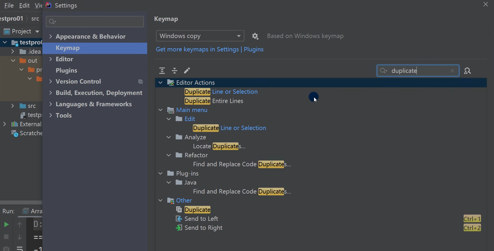
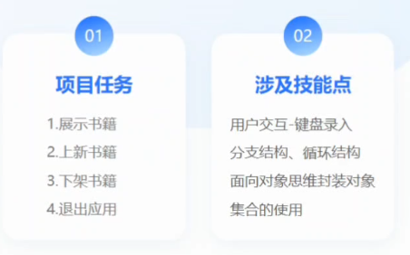

# java快速入门

## IDEA软件快捷键及配置

- **IDEA快捷方式**

  - **ctrl + D 删除当前当前行**
  - **ctrl + alt + 向下光标 复制当前行**
  - **ctrl + /  添加/取消注释**
  - **alt + /  补全代码**
  - **ctrl + alt + L 格式化**
  - **alt + R 运行**
  - ctrl + B 查看源码
  - alt + enter 导入改行需要配置的类
  - alt + 小键盘0  生成构造器等
  - ctrl + H  查看类的层级关系（学习继承后有用）
  - ctrl+ B  将光标放在一个方法上，输入 ctrl+B，可以定位到方法「学继承后，非常有用]
  - 自动的分配变量名,通过在后面加.var  如：new Person().var 再回车即可

- **模板**/**自定义模板**

  - file->settings -> deitor -> Live templates
  - 常用：main、sout  fori

  

  

## 老马书城集合版本

需求

