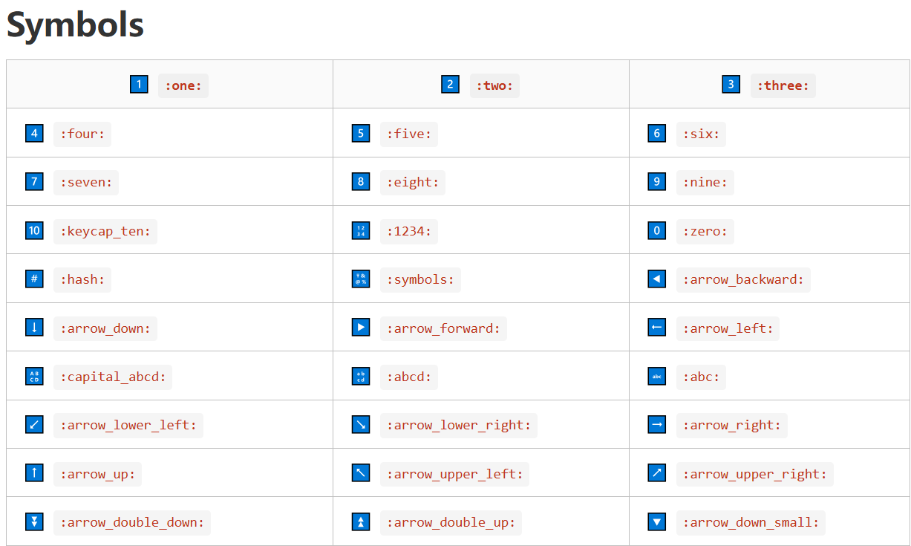

```
一、标题
使用方法：
# 一级标题
## 二级标题
### 三级标题
#### 四级标题
##### 五级标题
###### 六级标题
```

# 一级标题

## 二级标题

### 三级标题
#### 四级标题
##### 五级标题
###### 六级标题


```
二、斜体字、粗体字、删除内容，短文字
*斜体字*
**粗体字**
***斜体加粗***
~~删除的内容~~
—下划线—
`短文字`
```

*斜体字*
**粗体字**
***斜体加粗***
~~删除的内容~~
—下划线—
`短文字`

```
三、添加注释
>注释一段话
>添加引用内容
>>多级注释
```

> 这是一个注释

> 第一级注释
>
> > 第二级注释
> >
> > > 第三级注释

```
四、列表
* 无序列表1
* 无序列表2
	* 无序列表2.1
	* 无序列表2.1
1.(按空格)有序列表1
2.(按空格)有序列表2
```

* 无序列表1

* 无序列表2
  * 无序列表2.1
  * 无序列表2.1

1. 有序列表1
2. 有序列表2
3. 有序3
   1. 有序3.1
   2. 有序3.2

```
五、复选框
- [ ] 今日待办事项1
```

- [ ] 待办1
- [ ] 待办2

```
六、分割线
*** 或者---
```

***

---

```
七、插入代码
三个“ ``` ” 提示：键盘数字1左边那个点
三个“ ```java”  可以添加编程语言
```

```java
//这是一个java代码块
```

```
八、网页链接
[跳转到B站](https://www.bilibili.com/)
```

[跳转到B站](https://www.bilibili.com/)

```
九、表格（一般直接右键插入，选好几行几列 更方便）
标题|标题|标题
:--:|:--|:--:
第一个格子|第二个格子|第三个格子
第一个内容|第二个内容|第三个内容
```

|    标题    | 标题       |       标题 |
| :--------: | :--------- | :---------: |
| 第一个格子 | 第二个格子 | 第三个格子 |
| 第一个内容 | 第二个内容 | 第三个内容 |

```
十、目录
[TOC]
```

[TOC]

[toc]

```
十一、公式
$$
$$
```

$$
N23-x+y = x2
$$

```
十二、其他常用
下划线  Ctrl + U
==高亮==
:black
:red

```

<u>测试房价</u>阿拉善可能否数控刀具可视角度否

==高亮显示==

:black_circle:

:red_circle:

:girl:



[Typora表情大全]([Typora中的emoji表情_typora emoji-CSDN博客](https://blog.csdn.net/weixin_42395140/article/details/111642339))

