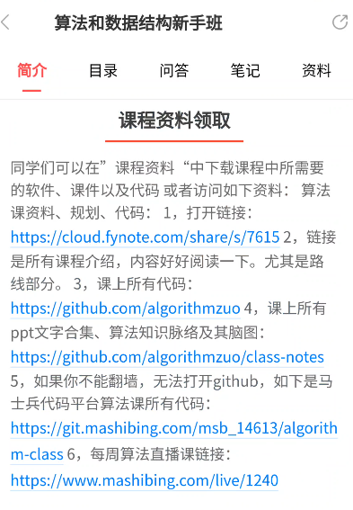
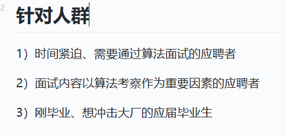
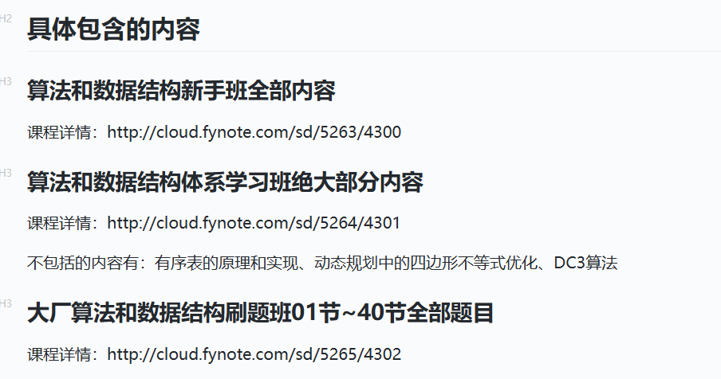

# 算法和数据结构新手班

所有代码

https://git.mashibing.com/msb_14613/algorithm-class.git
https://github.com/algorithmzuo/algorithm-primary

同学们可以在”课程资料“中下载课程中所需要
的软件、课件以及代码或者访问如下资料：算法
课资料、规划、代码：1，打开链接：
https://cloud.fynote.com/share/s/7615 2,
是所有课程介绍，内容好好阅读一下。尤其是路
线部分。3，课上所有代码：
https:/github.com/algorithmzuo4,课上所有
ppt文字合集、算法知识脉络及其脑图：
https://github.com/algorithmzuo/class-notes
5,如果你不能翻墙，
无法打开github,如下是马
士兵代码平台算法课所有代码：
https://git.mashibing.com/msb_14613/algorith
m-class6,每周算法直播课链接：
https://www.mashibing.com/live/1240

